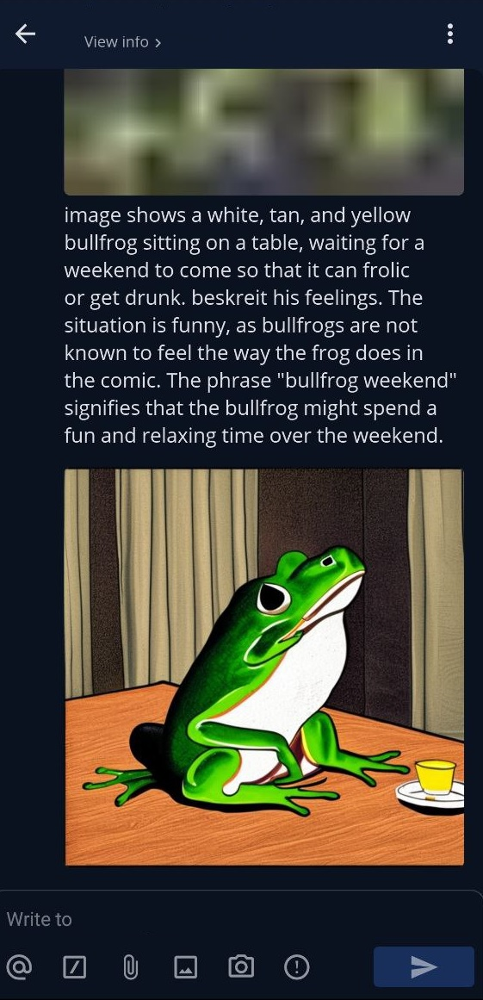

# Meme Generator
App for sheduled picture generation and auto posting in a messenger chat.

It uses Stable Diffusion model for image generation.
There are three modes for providing a prompt to it:
- configure reference image and use image scribing model to generate prompt based on refere nce  for text-to-image generation
- just use text prompt description for text-to-image generation
- use reference image directly for image-to-image conversion with prompt helping

There is also an option to continously update reference image with last produced image for image evolution effect.

After the inference has been completed, resulting images are posted via configured supported messenger API. Supported API's are telegram and mattermost. For telegram you have to provide bot token in SERVER_URL and have it present in specified chat, for mattermost you have to provide user login AUTH_LOGIN and password AUTH_PASSW through which outputs would be send, in the config file.

Inference job sheduling and everything else is configured in the config file (the process of running the script is described below)

Inference times on a test hardware for a single image:
- for text-to-image: gpu (rtx3060) ~ 1 min, cpu (i7-4770) ~ 12 min (depends on number of images).
- for image-to-image: gpu (rtx3060) ~ 15 sec, cpu (i7-4770) ~ 25 sec (depends on number of images).

### Prerequisites
 * python 3.12 (tested, should work for other)
 * cuda drivers and roughly 8 Gb of VRAM (if you use GPU), cpu is also supported 
 * about 18 Gb of free disk space for model weights
 
## Prepare the environment
For example, let's create new conda environment and run from there
```
conda create -n meme_env python=3.12
conda activate meme_env
```
cd to repo directory and execute to install dependencies:
```
pip install -r ./requirements.txt
```

## Usage
Create configuration file named "config" inside script directory
and set user parameters. Use this [example](resources/config_example) as reference.

If you want to use another image as reference, then specify it's path relative to the script folder and use a prompt with a following format:
```
USER: <image>
ask the model questions about an image here
ASSISTANT:
```
Alternatively you can leave image path unspecified and just provide a prompt to Stable Diffusion with an image description.

Run start_job.py file from the required environment, for example - from repo directory:
```
python start_job.py
```

## Example
Configure to describe the reference image and send it to Mattermost chat
Provide the following reference image:


Result in the messenger:




## License
This project is licensed under the MIT License - see the [LICENSE](LICENSE) file for details.
